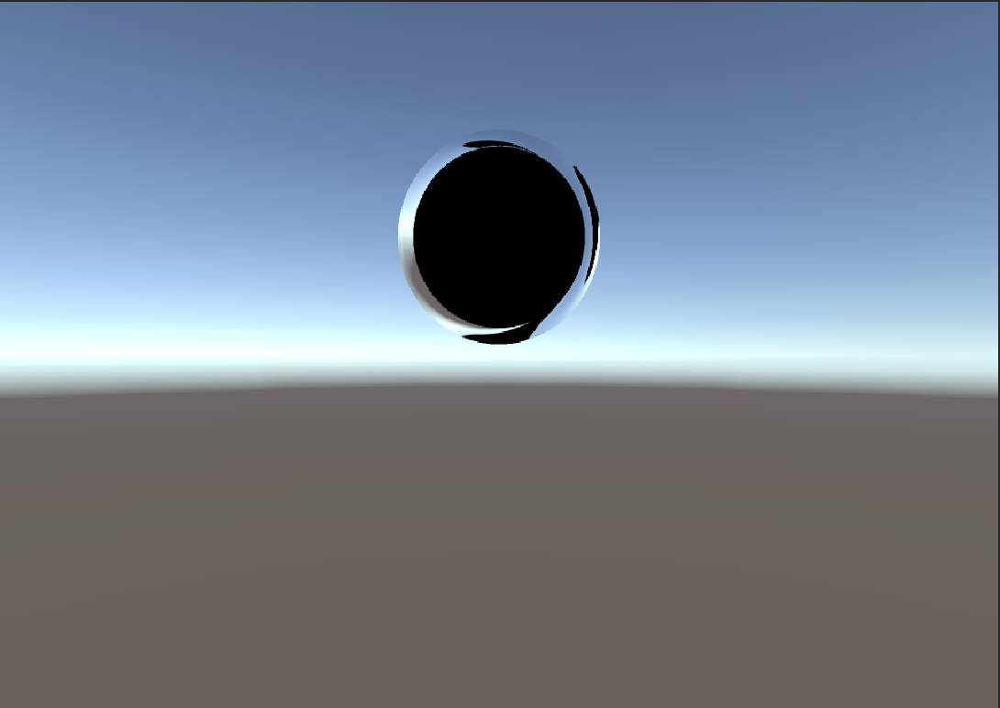

# Unity-Portal-Theme-Asset
Developer: Anthony A. Castor

This Source does not give any warranty please use at your own risk  

This plugin is adding a portal effect in the scene.  

This application is free of virus or malware  

<h3>Software Requirment </h3>
Unity 5.6 
Unity C# 

<h3>Online Portfolio</h3>
Distribution itch(Web and Desktop): https://goo.gl/Wq1nuD  
Distribution Google Play: https://goo.gl/uKIIr4  
Distribution Itunes AppStore: https://goo.gl/54yJPi  
Distribution Amazon Store: https://goo.gl/RUp1Od  
Distribution Windows Store: https://goo.gl/rCxsH6   (No Direct link to Dev Page)  
Distribution WearVR: https://goo.gl/y0X1nR  (No Direct link to Dev Page)  

<h3>More Information and Demo Videos </h3>
Facebook: https://goo.gl/vvDSIL  
Linkedin: https://goo.gl/c9Fh6n  
YouTube: https://goo.gl/BFZ7C5  
StackOverFlow: https://goo.gl/J1hFqL  
Github: https://goo.gl/jPHFPe  

<h3>Description</h3>
This plugin is adding a portal effect in the scene. 
•	Effect is good if you want to add a portal in your game. 
•	I add this becuase some people having problem in adding portal. 
•	This is only an example. 

